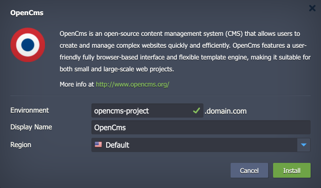

 

# OpenCms

The package deploys the [OpenCms](http://www.opencms.org/) solution - an open-source content management system (CMS) that allows users to create and manage complex websites quickly and efficiently. OpenCms features a user-friendly fully browser-based interface and flexible template engine, making it suitable for both small and large-scale web projects.

## Environment Topology

This package creates a dedicated OpenCms environment that contains one application server and one database container. It automatically deploys and sets the OpenCms application. The automatic vertical scaling is enabled out of the box, and [horizontal scaling](https://www.virtuozzo.com/application-platform-docs/automatic-horizontal-scaling/) can be configured (if needed). The default software stacks utilized in the package are the following:

- Tomcat 9 application server (Java 11)
- MariaDB 10 database
- OpenCms 18

## Deployment to Cloud

To get your OpenCms solution, click the "**Deploy to Cloud**" button below, specify your email address within the widget, choose one of the [Virtuozzo Public Cloud Providers](https://www.virtuozzo.com/application-platform-partners/), and confirm by clicking **Install**.

> If you already have a Virtuozzo Application Platform (VAP) account, you can deploy this solution from the [Marketplace](https://www.virtuozzo.com/application-platform-docs/marketplace/) or [import](https://www.virtuozzo.com/application-platform-docs/environment-import/) a manifest file from this repository.

## Installation Process

In the opened installation window at the VAP dashboard, provide a preferred environment and display names, choose a region (if available), and confirm the installation.

Your OpenCms application will be automatically installed in a few minutes.
